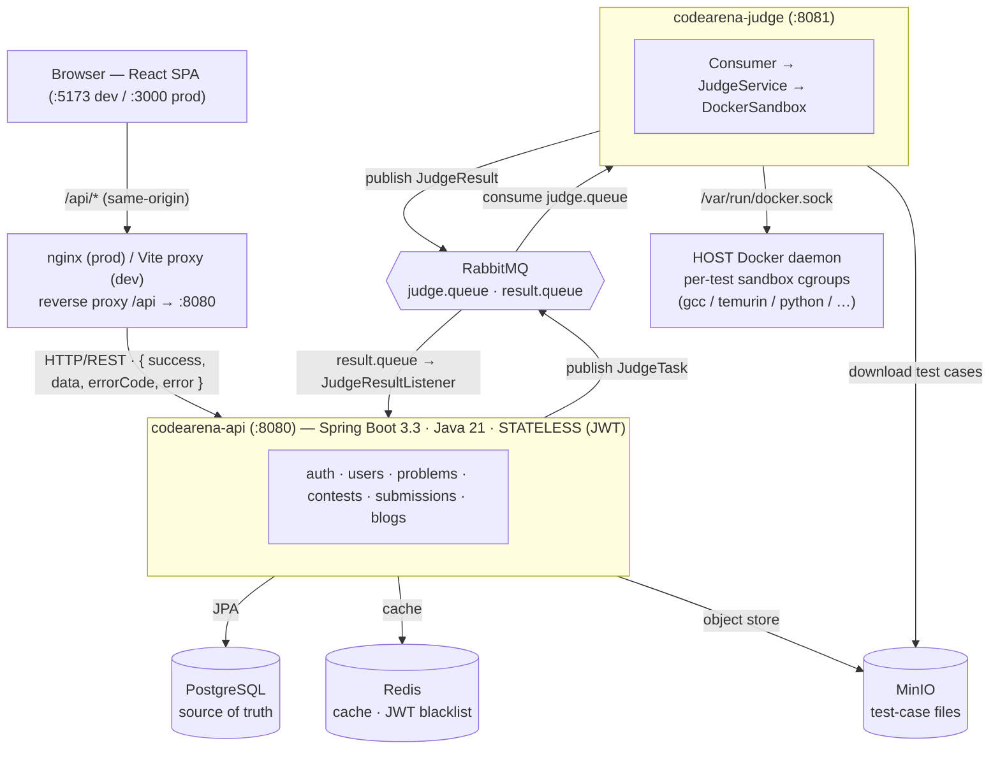
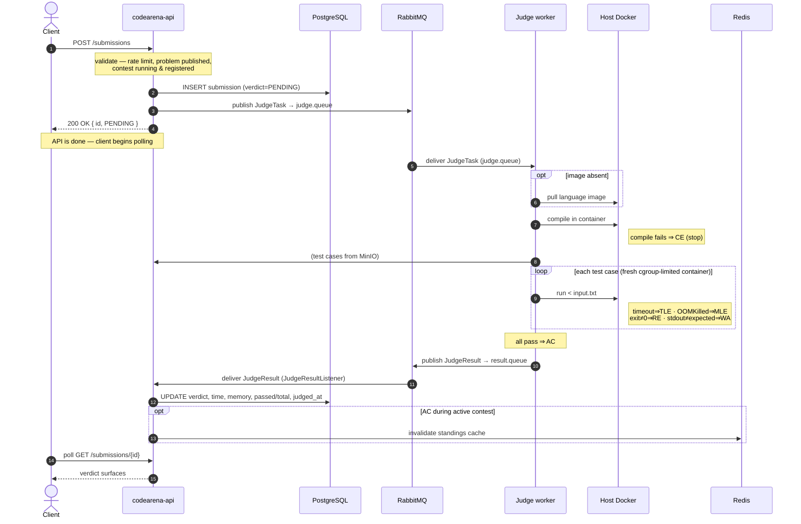
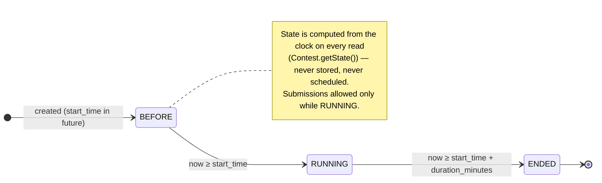
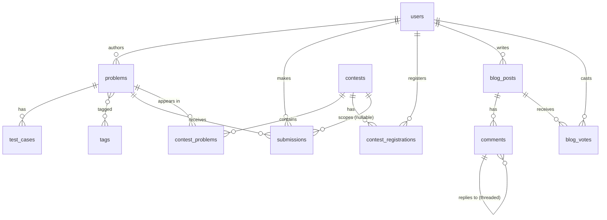

# CodeArena — System Design

> A Codeforces-style competitive programming platform: register, browse problems,
> submit code in 8 languages, get it judged in isolated Docker sandboxes, and
> climb live ICPC standings. Java 21 + Spring Boot 3.3 backend, React + TypeScript
> frontend, async judge worker.

**Contents**
1. [High-Level Design](#1-high-level-design)
2. [Key Design Tradeoffs](#2-key-design-tradeoffs)
3. [Low-Level Design](#3-low-level-design)
4. [Failure Modes & Resilience](#4-failure-modes--resilience)
5. [Scaling Path](#5-scaling-path)

---

## 1. High-Level Design

### 1.1 Goals & Non-Goals

**Goals**
- Correct, isolated, resource-limited code execution for untrusted submissions.
- API stays responsive regardless of judging load (judging can take seconds).
- No submission is ever lost, even if a judge worker crashes mid-execution.
- Horizontal scalability of the judging tier independent of the API tier.
- Clean module boundaries so features (contests, blogs) evolve independently.

**Non-Goals (current)**
- Rating recalculation engine (contests store `is_rated` but ratings stay static).
- Multi-region / HA database. Single Postgres primary is assumed.
- Real-time push (standings/verdicts are poll-based, not WebSocket).

### 1.2 Component Topology



### 1.3 Responsibilities

| Component | Owns | Does **not** own |
|---|---|---|
| **Frontend** | Rendering, client-side routing, JWT storage, polling | Any trust decision (purely a view) |
| **API** | Persistence, auth, validation, orchestration, caching | Code execution |
| **Judge worker** | Compilation, sandboxed execution, verdict computation | Persistence (it only emits results) |
| **PostgreSQL** | System of record for all durable state | Caching, large blobs |
| **Redis** | Response cache, standings cache, JWT blacklist | Anything that must survive a flush |
| **RabbitMQ** | Durable hand-off API ↔ judge, back-pressure buffer | Business logic |
| **MinIO** | Test-case files (potentially large) | Relational metadata |

### 1.4 The Submission Lifecycle (the core flow)



---

## 2. Key Design Tradeoffs

Each decision below is written as **what we chose → what we gave up → why it's worth it**. These are the load-bearing choices.

### 2.1 Async judging via a message queue (not synchronous, not a thread pool)

- **Chosen:** API publishes a `JudgeTask` to RabbitMQ and returns immediately; a separate worker pool consumes.
- **Alternatives:** (a) judge inline in the request thread; (b) in-process `@Async` executor.
- **Gave up:** simplicity — there are now two deployables, a broker, and eventual-consistency on verdicts (client must poll).
- **Why worth it:**
  - Judging takes 100ms–several seconds (image pull, compile, N test runs). Blocking an HTTP worker thread that long destroys API throughput under load.
  - The queue is a **back-pressure buffer**: a submission spike queues instead of melting the judges.
  - The judge tier scales **independently** — add consumers without touching the API.
  - Durability: an in-process executor loses all queued work on crash; RabbitMQ persists it (see §4).

### 2.2 Docker-out-of-Docker for the sandbox (not Docker-in-Docker, not a shared runner)

- **Chosen:** the judge container mounts the **host** `/var/run/docker.sock` and asks the host daemon to spawn sibling sandbox containers.
- **Alternatives:** (a) Docker-in-Docker (privileged nested daemon); (b) run submissions as bare host processes with `ulimit`/`nsjail`.
- **Gave up:** a clean security boundary — socket access ≈ root on the host; and a sharp operational gotcha (bind-mount path resolution, see below).
- **Why worth it:** DinD is notoriously fragile (storage-driver issues, needs `--privileged`) and heavier; bare processes give far weaker isolation than a fresh container per run. DooD is the pragmatic middle for a single-host deployment.
- **The cost we paid in code:** because the **host** daemon resolves bind mounts, the judge's scratch dir must exist at the *same absolute path* inside the judge container and on the host. Hence `JUDGE_WORK_DIR=/tmp/codearena-judge` bind-mounted 1:1, and the judge runs **as root** (a non-root UID can't open the mounted socket — the host docker group GID doesn't exist in the container). *(This was a real bug found during testing: without the shared path, `/sandbox` was empty and every submission failed CE.)*
- **Production hardening path:** swap the sandbox backend for gVisor/Kata or a per-tenant Firecracker microVM; the `DockerSandbox` seam is the only thing that changes.

### 2.3 One fresh container per test case (not one container for the whole submission)

- **Chosen:** compile in its own container; run **each** test case in a brand-new container sharing the per-submission bind dir.
- **Gave up:** speed — container create/start/teardown per test is real overhead.
- **Why worth it:** no state leaks between test cases (files written, lingering processes, memory pressure). The cgroup memory limit and timeout reset cleanly each run, so TLE/MLE attribution is correct per test. Compile artifacts (the binary / `.class`) still persist because compile and run **share the bind mount** — that's what makes the separate-container split safe.

### 2.4 Input via file redirect, not stdin attach

- **Chosen:** write the test input to `/sandbox/input.txt` and run `sh -c '<cmd> < /sandbox/input.txt'`.
- **Gave up:** the "natural" `docker attach` stdin streaming.
- **Why worth it:** docker-java's stdin attach has no reliable EOF signal — programs that read until end-of-input **hang forever**, manifesting as spurious TLEs. *(Also found during testing.)* A file redirect gives a clean, guaranteed EOF.

### 2.5 MLE from the cgroup `OOMKilled` flag, not exit code 137

- **Chosen:** after a run, inspect `State.OOMKilled` to distinguish MLE from RE.
- **Gave up:** nothing meaningful.
- **Why worth it:** an OOM kill and a plain `SIGKILL` both surface as exit 137 — exit code alone can't tell "exceeded memory" from "killed for another reason." The daemon's explicit flag is unambiguous, so MLE never masquerades as RE.

### 2.6 Verdict delivery: client polling, not WebSockets/SSE

- **Chosen:** client polls `GET /submissions/{id}` while `PENDING`/`JUDGING`.
- **Gave up:** instant push; a little redundant traffic.
- **Why worth it:** the API stays fully stateless (trivial to scale and load-balance), and there's no sticky-session or connection-fan-out complexity. At this scale, polling is dramatically simpler for a near-identical UX. Push is a clean future upgrade if needed.

### 2.7 Standings via raw `JdbcTemplate`, not JPA

- **Chosen:** `StandingsService` computes standings with a single hand-written SQL query streamed through `JdbcTemplate`.
- **Gave up:** ORM uniformity (the rest of the app is Spring Data JPA).
- **Why worth it:** standings is an aggregation over potentially thousands of submissions ordered by time — exactly where JPA entity hydration and the N+1 trap hurt. Raw SQL + a single row-callback that folds results into per-user state is the right tool. **Plus a Redis cache** (30s TTL while running, 5min when ended, invalidated on each contest AC) so the expensive scan rarely runs.

### 2.8 Rate limiting via a DB recency check, not Redis counters

- **Chosen:** `existsRecentByUserId(userId, now-10s)` against `submitted_at`.
- **Gave up:** the "textbook" Redis token-bucket.
- **Why worth it:** zero extra moving parts, and the limit **survives an API restart** (state lives in Postgres, which we already query on submit). The submit path already hits the DB, so the marginal cost is one indexed existence check. *(Honest limitation: this is per-row recency, not a true sliding-window bucket — fine for "1 submission / 10s / user"; revisit if limits get richer.)*

### 2.9 Computed contest state, not a stored status column

- **Chosen:** `Contest.getState()` derives `BEFORE / RUNNING / ENDED` on the fly from `start_time + duration_minutes`.
- **Gave up:** the ability to query "all running contests" purely in SQL without a time predicate.
- **Why worth it:** no scheduler, no cron, no risk of a stored status drifting out of sync with the clock. State is always correct by construction. List queries pass `now` as a parameter (`findRunning(now, …)`), which is cheap and indexed.



### 2.10 Same-origin frontend (reverse proxy), not CORS

- **Chosen:** nginx (prod) / Vite (dev) proxy `/api` to the API; browser only ever talks to one origin.
- **Gave up:** the ability to host the SPA on a totally separate origin without extra config.
- **Why worth it:** the backend needs **zero CORS configuration** (no preflight, no allow-list to maintain), and cookies/headers "just work." The proxy also lets the SPA boot before the API is ready (returns 502 until up) rather than failing.

### 2.11 Build images from `gradle:8.10.2-jdk21-alpine`, not the Gradle wrapper

- **Chosen:** Docker build stage uses the official Gradle image.
- **Gave up:** nothing — same Gradle version.
- **Why worth it:** the wrapper downloads the Gradle distribution from `services.gradle.org` on every cache-busting change, which was flaky from the build network and broke image builds. The Gradle image ships it preinstalled → reproducible, offline-friendly builds. *(Another real fix from this session.)*

### 2.12 Defense-in-depth sandbox limits, not just memory + network

- **Chosen:** beyond the memory cap and `--network none`, every run also drops all Linux capabilities, sets `no-new-privileges`, caps PIDs at 128, and bounds captured output at 1 MB/stream.
- **Gave up:** a few extra `HostConfig` knobs and a slightly more involved log callback.
- **Why worth it:** memory + network limits stop the *obvious* attacks, but a fork bomb (PID exhaustion), an output flood (OOMs the *judge*, not the sandbox), and a `setuid` trick are each cheap, independent, and uncovered by those two. Every guard is ~one line and closes a distinct DoS/escalation vector — verified by running an actual fork bomb and output flood against a live worker (judge survived both).

### 2.13 Pre-pull sandbox images at startup, not lazily on first use

- **Chosen:** the worker pulls all sandbox images on a background daemon thread when it boots.
- **Gave up:** a slower, more bandwidth-heavy startup; images are fetched even for languages that may never be used on that host.
- **Why worth it:** otherwise the *first* submission in each language eats the pull latency (gcc:13 ≈ 1.4 GB ⇒ tens of seconds of "stuck on PENDING"), which looks like a hang to the user. Backgrounding it means judging still starts immediately and simply skips the pull for images already present.

---

## 3. Low-Level Design

### 3.1 Module layout (modular monolith)

The API is a **modular monolith** — organized by domain, not by technical layer. Each module owns its `controller / service / repository / entity / dto`. This keeps feature code cohesive and makes a future extraction into services mechanical.

```
com.codearena
├── config/        SecurityConfig, JwtAuthenticationFilter, JwtConfig, RedisConfig,
│                  RabbitMQConfig, MinioConfig, OpenApiConfig, CorrelationIdFilter
├── common/        ApiResponse<T> envelope, GlobalExceptionHandler,
│                  Business/ResourceNotFound exceptions, MinioService, JwtUtil
├── user/          auth (register/login/refresh/logout) + profiles + leaderboard
├── problem/       problems, tags, test-case upload, sample I/O
├── contest/       contests, registrations, StandingsService (ICPC)
├── submission/    submit → publish; JudgeResultListener consumes results
└── blog/          posts, threaded comments, votes

com.codearena.judge   (separate deployable)
├── consumer/      SubmissionConsumer  (@RabbitListener on judge.queue)
├── service/       JudgeService        (orchestration)
├── sandbox/       DockerSandbox       (container lifecycle, the security seam)
│                  ImagePrePuller      (background image warm-up on startup)
└── dto/           JudgeTask, JudgeResult   (the wire contract)
```

**Conventions:** DTOs are Java `record`s (never expose entities at the boundary); services use constructor injection; controllers are thin (validate → delegate → wrap); all list endpoints return `Page<T>`; every schema change is a numbered Flyway migration (no `ddl-auto`).

### 3.2 Data model (PostgreSQL)



Detailed schema (⚷ = unique, `→` = FK, indexes called out per hot path):

```
users(id, username⚷, email⚷, password_hash[bcrypt], role, rating, max_rating,
      avatar_url, timestamps)                        idx: username, rating DESC

problems(id, title, slug⚷, statement, input_format, output_format, difficulty,
         time_limit_ms=2000, memory_limit_mb=256, author_id→users, is_published)
tags(id, name⚷)   problem_tags(problem_id, tag_id)            -- M:N
test_cases(id, problem_id→problems, input_url, expected_output_url,
           is_sample, order_index)                   -- *_url = MinIO object keys

contests(id, slug⚷, title, description, type, start_time, duration_minutes,
         is_rated, author_id→users)                  -- state is COMPUTED, not stored
contest_problems(contest_id, problem_id, label, order_index, points)
                 UNIQUE(contest_id, problem_id), UNIQUE(contest_id, label)
contest_registrations(contest_id, user_id)  UNIQUE(contest_id, user_id)

submissions(id, user_id→, problem_id→, contest_id→ NULLABLE, language, source_code,
            verdict, time_used_ms, memory_used_kb, test_cases_passed, total,
            submitted_at, judged_at)
   idx: user_id, problem_id, contest_id, verdict, (user_id,problem_id), submitted_at DESC

blog_posts(id, author_id→, title, content, upvotes, downvotes, timestamps)
comments(id, blog_post_id→, author_id→, parent_id→comments NULLABLE, content, ts)  -- threaded
blog_votes(blog_post_id, user_id, vote_type)  UNIQUE(blog_post_id, user_id)        -- 1 vote/user
```
*(⚷ = unique. `→` = FK.)* Indexes target the hot paths: leaderboard (`rating DESC`), submission filters (`verdict`, `(user_id, problem_id)`), and recent-submissions feeds (`submitted_at DESC`).

### 3.3 Authentication & authorization

**JWT access/refresh pair**, fully stateless on the API:
- **Access token** (short-lived, `jwt.access-expiry-ms`): carries `userId`, `username`, `role`, and a `type` claim.
- **Refresh token** (long-lived): mints new pairs only. The `type` claim is checked so a refresh token can't be replayed as an access token.
- **`JwtAuthenticationFilter`** runs before `UsernamePasswordAuthenticationFilter`, validates signature + expiry + blacklist, and populates the `SecurityContext` (principal = `userId`).

**Blacklist (Redis)** — the one piece of server-side auth state:
- On **logout**, both tokens are stored at `blacklist:<token>` with TTL = their remaining lifetime.
- On **refresh**, the old refresh token is blacklisted before a new pair is issued (rotation). *Verified: a rotated or logged-out token is rejected on reuse.*

**RBAC** (`USER` ⊂ `PROBLEM_SETTER` ⊂ `ADMIN`) enforced with method-level `@PreAuthorize`. Public reads (`GET` on problems, contests, blogs, profiles, the recent-submissions feed) are `permitAll`; everything else requires a valid token. *(Known quirk: unauthenticated hits return Spring's default 403, not 401.)*

### 3.4 Judge internals (`DockerSandbox`)

**Per-run container constraints:**

| Constraint | Value | Mechanism |
|---|---|---|
| CPU | 1 core | `withCpuCount(1)` |
| Memory | problem's `memory_limit_mb`, **swap disabled** | `withMemory` + `withMemorySwap` equal |
| Network | none | `withNetworkMode("none")` |
| PIDs | ≤ 128 (fork-bomb guard) | `withPidsLimit(128)` |
| Capabilities | all dropped, no privilege escalation | `withCapDrop(ALL)` + `no-new-privileges` |
| Output | ≤ 1 MB captured per stream | bounded buffer in the log callback |
| Filesystem | `/sandbox` ← per-submission dir under `JUDGE_WORK_DIR` | bind mount |
| Wall-clock | `time_limit_ms + 2000ms` grace | `waitContainer … awaitCompletion(timeout)` |

Per-test **wall-clock time** is measured around `sandbox.execute()` and reported as
`time_used_ms` (the max across test cases); it includes container start overhead, so
it's an upper bound on the solution's own runtime. On startup the worker
**pre-pulls all sandbox images** on a background daemon thread (`ImagePrePuller`),
so the first submission in a language doesn't stall on a multi-hundred-MB pull.

**Language matrix** (compile container → run container, sharing the bind dir):

| Lang | Image | Compile | Run |
|---|---|---|---|
| C++ | `gcc:13` | `g++ -O2 -o /sandbox/solution solution.cpp` | `/sandbox/solution` |
| C | `gcc:13` | `gcc -O2 …` | `/sandbox/solution` |
| Java | `eclipse-temurin:21-jdk-alpine` | `javac Solution.java` | `java -cp /sandbox Solution` |
| Python | `python:3.12-slim` | — | `python3 solution.py` |
| JavaScript | `node:20-slim` | — | `node solution.js` |
| Go | `golang:1.22-alpine` | `go build -o /sandbox/solution` | `/sandbox/solution` |
| Rust | `rust:1.77-slim` | `rustc -O -o /sandbox/solution` | `/sandbox/solution` |
| Kotlin | `codearena-kotlin:21` (custom: Temurin 21 + kotlinc) | `kotlinc … -include-runtime -d solution.jar` | `java -jar solution.jar` |

**Verdict decision order** (per test, first match wins): `timedOut → TLE`, `oomKilled → MLE`, `exit≠0 → RE`, `stdout.trim()≠expected.trim() → WA`; all tests pass → `AC`; compile non-zero → `CE`.

**Test-case storage (MinIO)** — deterministic, sort-stable keys so the judge can pair them by lexical order:
```
testcases/{problemId}/00000/input.txt
testcases/{problemId}/00000/output.txt
testcases/{problemId}/00001/input.txt
testcases/{problemId}/00001/output.txt
```
*(Originally random UUID keys — but the judge pairs sorted keys, so UUIDs scrambled input/output pairing. Fixed to zero-padded order indices.)* Sample cases (`is_sample=true`) are additionally exposed as **text** via `GET /problems/{slug}/samples`; hidden cases are never served by that endpoint.

### 3.5 Caching strategy (Redis)

| Key | TTL | Invalidation |
|---|---|---|
| `problem:<slug>` | long | evict on problem update |
| `tags:all` | long | evict on tag create |
| `user:profile:<username>` | long | evict on profile update |
| `standings:contest:<id>` | 30s running / 5min ended | TTL + manual on contest AC |
| `blacklist:<token>` | remaining token TTL | natural expiry |

Cache values are serialized with a Jackson `ObjectMapper` configured with `JavaTimeModule` + default typing — required because DTOs carry `LocalDateTime` and cached records must rehydrate to their concrete types on a hit. *(The stock serializer threw on `LocalDateTime`; this was a fix.)*

### 3.6 ICPC standings algorithm

`StandingsService.computeStandings()`:
1. Stream all contest submissions ordered by `submitted_at ASC` (raw SQL, `JdbcTemplate`).
2. Per `(user, problem)`: ignore everything after the first AC; count wrong `attempts` before it; record `solvedAtMinute`.
3. On first AC: `penaltyMinutes += solvedAtMinute + 20 * attempts` (the classic 20-minute ICPC penalty per wrong try).
4. Rank: `solvedCount DESC`, then `penaltyMinutes ASC`.

Read-through Redis cache (§3.5) keeps this off the hot path; a contest AC invalidates the entry so standings update promptly.

### 3.7 Error handling & API envelope

Every response is `ApiResponse<T> = { success, data, errorCode, error }`. A single `@RestControllerAdvice` maps exceptions → status + code:

| Exception | HTTP | code |
|---|---|---|
| `ResourceNotFoundException` | 404 | `RESOURCE_NOT_FOUND` |
| `BusinessException` | 400 | `BAD_REQUEST` |
| `MethodArgumentNotValid` | 400 | `VALIDATION_ERROR` |
| `MethodArgumentTypeMismatch` | 400 | `BAD_REQUEST` |
| `HttpMessageNotReadable` | 400 | `BAD_REQUEST` |
| `AccessDenied` | 403 | `ACCESS_DENIED` |
| `NoResourceFound` | 404 | `RESOURCE_NOT_FOUND` |
| (fallback) `Exception` | 500 | `INTERNAL_ERROR` |

*(The type-mismatch / unreadable / no-resource handlers were added so malformed input returns clean 400/404s instead of 500s.)*

### 3.8 Observability

- **Structured JSON logs** under the `prod` profile (Logback) — ELK/Datadog/CloudWatch-ready.
- **Correlation IDs**: `CorrelationIdFilter` injects `X-Correlation-ID` (generated if absent) into the MDC, so every log line for a request shares one ID; it's echoed back in the response header.
- **Health**: `GET /actuator/health` (checks Postgres, Redis, RabbitMQ connectivity).
- **API docs**: SpringDoc OpenAPI at `/swagger-ui.html`, with `@Schema` examples on DTOs.

### 3.9 Testing & CI

- **75 unit/slice tests**: 61 on the API (Mockito + MockMvc, no infra required) and 14 on the judge (the language-spec matrix — guarding image names, compile vs interpreted, unsupported-language rejection).
- **End-to-end verification** against the live Dockerized stack (~70 checks): every endpoint, all six verdicts, multiple languages incl. compiled ones, concurrency, worker-crash redelivery, cold-restart persistence, JWT-attack rejection, and sandbox abuse (fork bomb, output flood).
- **CI** (`.github/workflows/ci.yml`) runs the backend tests, the frontend typecheck+build, and all three Docker image builds on every push/PR.

---

## 4. Failure Modes & Resilience

These were exercised, not just designed.

| Failure | Behavior | Why |
|---|---|---|
| **Judge worker down** when a submission arrives | submission sits `PENDING`; the `JudgeTask` waits in the **durable** `judge.queue`; judged on restart | durable queue + persistent messages |
| **Judge killed mid-judgment** | the in-flight (unacked) message is **redelivered** to another/restarted consumer → submission still completes | manual/auto-ack on the listener; broker requeues on channel close |
| **Full stack cold restart** (`down`/`up`) | all data persists (Postgres + MinIO volumes); judge reconnects; **zero stuck** submissions | state lives in durable stores, not memory |
| **First submission in a language** | one-time image pull stalls that job (gcc:13 ≈ 1.4GB); others unaffected | pre-pull images on the judge host to avoid |
| **Submission spike** | requests queue in RabbitMQ instead of overloading judges | queue as back-pressure buffer |
| **Memory-bomb solution** | container OOM-killed → reported `MLE`, host unharmed | cgroup memory cap + `OOMKilled` flag |
| **Infinite loop** | killed at `time_limit + 2s` → `TLE` | wall-clock wait timeout |
| **Network-abusing solution** | no network exists in the sandbox | `--network none` |
| **Fork bomb** | capped at 128 PIDs → fails (RE), host unaffected | `--pids-limit` |
| **Output flood** | captured output bounded at 1 MB/stream → judge can't OOM on the buffer | bounded log callback |
| **Privilege-escalation attempt** | no capabilities, `setuid` blocked | `--cap-drop ALL` + `no-new-privileges` |

---

## 5. Scaling Path

The architecture already separates the two axes that scale differently:

- **API tier** — stateless (JWT, no session affinity). Scale horizontally behind a load balancer; the only shared state is Redis + Postgres. Reads are cached; hot paths are indexed.
- **Judge tier** — scale by adding `codearena-judge` consumers on more hosts. RabbitMQ distributes `judge.queue` across them; `prefetch=1` keeps work fairly balanced. This is the tier that will saturate first under contest load, and it scales without touching the API.

**Next bottlenecks & moves, in order:**
1. **Postgres reads** under contest traffic → read replicas; the submissions feed and standings are the heaviest readers (standings is already cached).
2. **Sandbox security** for true multi-tenant/public hosting → replace `DockerSandbox` internals with gVisor/Kata/Firecracker (single, well-isolated seam).
3. **Verdict latency UX** → swap polling for SSE/WebSocket push (the result-queue consumer already has the event; only delivery changes).
4. **MinIO** → front large test-case downloads with a CDN/cache, or co-locate judges with the object store.

---

### Appendix: current known gaps (intentional, documented)

- Verdict/standings updates are poll-based, not pushed (no WebSocket).
- No plagiarism detection on submissions.
- Unauthenticated requests return `403` rather than `401` (Spring Security default).
- Verdict/standings delivery is poll-based, not pushed.
